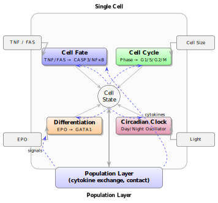

## Summary 
This repository provides code for simulating Boolean network–based models of cellular decision-making.  
The framework is modular, allowing different biological processes to be represented together in a unified way.  
Rather than studying a single pathway in isolation, the aim here is to capture how various decision processes interact within the cell.  
The project focuses on key cellular fates such as **survival or death, division, differentiation, or maintaining circadian rhythms**.  
To achieve this, we have developed four core modules, each modeled using Boolean automata.

1. **Cell Fate Switch (TNF/FAS driven) :** Decides between survival, apoptosis, or necrosis.  
2. **Cell Cycle (yeast-inspired) :** Captures progression through different cell cycle stages.  
3. **Differentiation Switch (GATA-1/EPO signaling) :** Balances self-renewal vs. differentiation.  
4. **Circadian Oscillator :** A two-state Boolean clock to track timing and synchronization.  

  

#### Functioning
- The modules are combined into an **agent-based simulation**.  
- Each cell can interact with its neighbors and exchange signals.  
- We run simulations for both **wild-type and mutant cases**.  
- We explore **attractor landscapes** and **synchronization dynamics** across populations.  

## Documentation
Find the detailed documentation of SysBioBoolSim that contains the code for the
implementation of the Boolean network in the manuscript.
[Documentation](https://github.com/Riddhiman2005/SysBioBoolSim/raw/main/Documentation.pdf)

